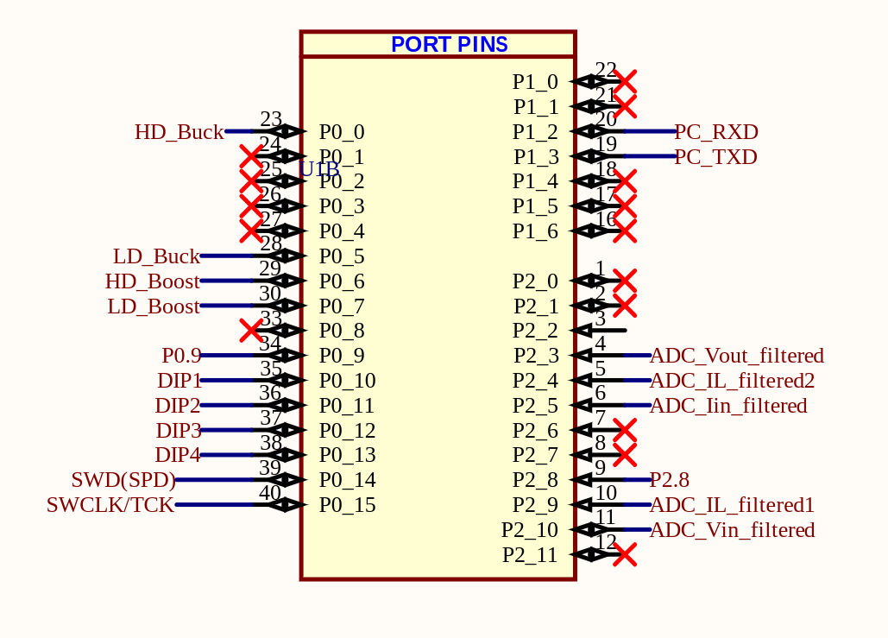

# Industry Meets Makers 2024 @ Infineon \#IMM24

This is the official Infineon GitHub repository for Industry Meets Makers 2024.

## Intended use cases

These examples can be used as a starting point for your project. They are meant to be used with DAVE 4.5.0

# Tasks

- Create a Maximum Power Point Tracking (MPPT) algorithm.
- Develop a MPPT control structure to be integrated into the existing SW framework:
    - Firmware implementation
    - Testing
    - Documentation
- Optional: Use boost circuit to keep highside constant on to lower the materials count.

# Device Details

